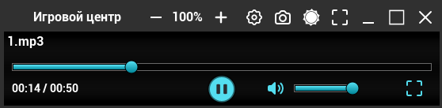
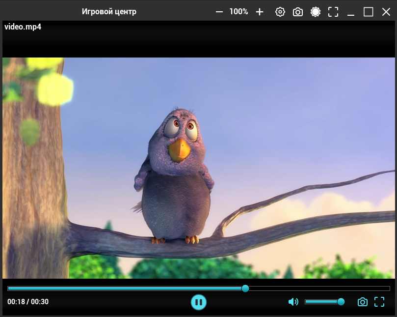

Аудио / Видео плеер, сразу два в одном :)  
#### Аудио не требует модуль, а вот видео да
#### Это эксперимент для windows, найти рабочий плеер в интернете сложно, а вот собирать код по кусочкам из уроков, и потом разбираться, то что нужно :)
Не требует установки потому что загружается когда запускается игровой центр, а вот для запуска видео нужен модуль который ставится в один клик (это dll модуль с ffmpeg)  
ffmpeg весит много, к счастью удалось запихнуть в dll модуль, чтобы не увеличился сильно размер игрового центра.  
Видео модуль ставится по желанию)  
  

